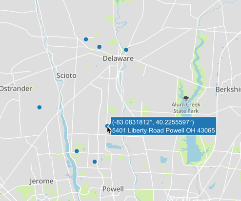

# Sheriff Sale Web Scraper

The [Sheriff Sale Website](https://sheriff.co.delaware.oh.us/sheriff-sales/) for my county does not provide users with the ability to determine where each property is located on a map. Instead of manually copying each address to Google Maps, I created a script that scrapes each property address and plots all of the addresses on a map.

## Script Overview

1. Gathers all property addresses from website
2. Retrieves the geolocation for each property address (latitude and longitude)
3. Uses the geolocation for each address to build a map that specifies where each address is located.

## Built With

* [Beautiful Soup](https://www.crummy.com/software/BeautifulSoup/) - Used to scrape website
* [Plotly](https://plot.ly/#/) - Used to plot the data
* [Mapbox](https://plot.ly/#/) - Used to provide the map
* [Geocoder](https://github.com/DenisCarriere/geocoder) - Used to determine the latitude and longtitude for each address
* [Requests](https://github.com/requests/requests) - Who doesn't use requests?